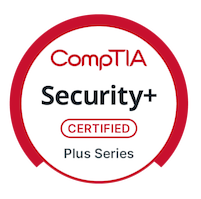
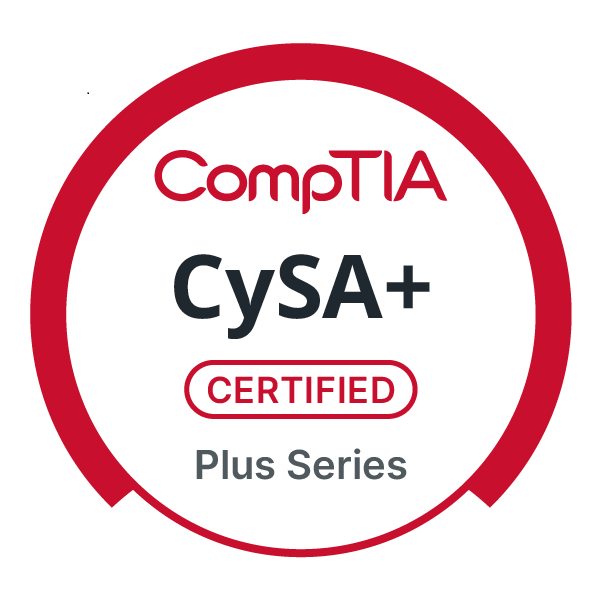
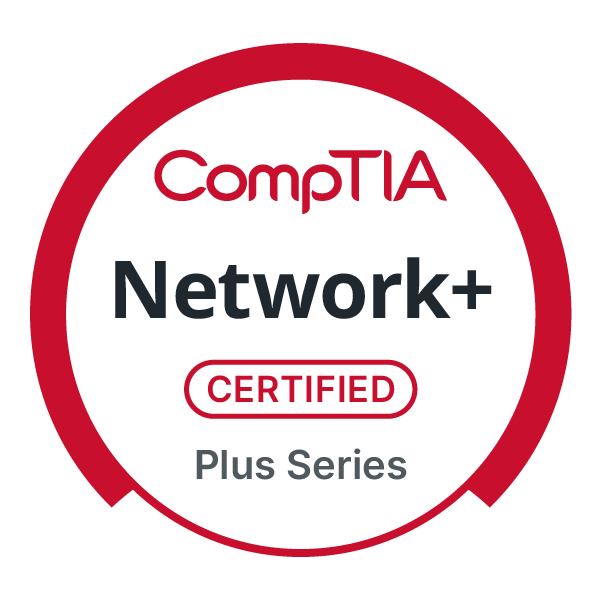

# Hello, I'm Nigel | Cybersecurity Professional  

I’m a GIAC-certified cybersecurity professional who investigates security alerts, analyzes endpoint and network activity, and supports threat detection and incident response using Splunk, Microsoft Sentinel, Defender XDR, and Elastic Stack. My background in education strengthens my communication, problem-solving, and ability to turn technical findings into clear, actionable insights.  

## Objective
Seeking to leverage SOC analysis and detection engineering skills to contribute to proactive threat detection, automate investigations, and strengthen organizational defenses. 

## Featured SOC Investigations

| Investigation | Focus Area | Tools Used | Status |
|---|---|---|---|
| [KCD Ransomware: Shadow Copy Deletion](https://github.com/ndean06/soc-investigations/tree/main/soc-simulator-investigations/004-kcd-ransomware-shadow-copy-deletion) | Ransomware, RDP Access, Recovery Impairment | Splunk, Sysmon, Windows Security Logs, Defender |  Complete |
| [KCD Nemesys Ransomware: Registry Run-Key Persistence](https://github.com/ndean06/soc-investigations/tree/main/soc-simulator-investigations/005-KCD-Web-Nemesys-Ransomware) | Malware Triage, Registry Run-Key Persistence, Defender Detection | Splunk, Sysmon, Defender | Complete |
| KCD Anomalous Process Creation | Suspicious Process Execution, ATT&CK Mapping | Splunk, Sysmon | In Progress |

## Featured Projects

| Project | Focus Area | Skills Demonstrated |
|---|---|---|
| [AI-Assisted SOC Automation & Alert Triage Pipeline](https://github.com/ndean06/soc-automation2-project) | SOC Automation & AI-Assisted Alert Triage | Splunk, n8n, OpenAI, Slack, DFIR-IRIS, Threat Intelligence |
| [Microsoft Cloud SOC: Detection & Incident Response Lab](https://github.com/ndean06/Microsoft-30Day-SOC-Challenge) | Cloud Security Monitoring & Incident Response | Microsoft Sentinel, Defender XDR, Incident Response |
| [SOAR + EDR Automated Incident Response Workflow](https://github.com/ndean06/soar-edr-incident-response) | Security Automation & EDR Response | SOAR, EDR, Alert Triage, Automated Response |

## Security Stack & Technical Skills

*Hands-on tools and technologies used across SOC investigations, incident response, threat detection, automation, DFIR, and cybersecurity labs.*

### SIEM, EDR & Detection

    
    
    
    
    
    

### SOC Automation & Case Management

    
    
    
    
    
    

### Endpoint & Windows Analysis

    
    
    
    
    

### Network Analysis

    
    
    
    
    

### Threat Intelligence & Enrichment

    
    
    
    

### DFIR & Malware Analysis

    
    
    
    
    
    
    
    
    

### Vulnerability Assessment & Security Testing

    
    
    
    
    

### Frameworks & Investigation Skills

    
    
    
    
    
    
    

### Operating Systems & Platforms

    
    
    
    

### Scripting & Query Languages

    
    
    

## Certifications

 

## Security Stack & Technical Skills

*Hands-on experience across SOC investigations, detection engineering, incident response, threat intelligence, automation, DFIR, and malware analysis.*

---

### SIEM, EDR & Detection

<table>
<tr>
<td align="center" width="120">
  <a href="https://www.splunk.com/">
     
    <b>Splunk</b>
  </a>
</td>

<td align="center" width="120">
  <a href="https://learn.microsoft.com/en-us/azure/sentinel/">
     
    <b>Microsoft Sentinel</b>
  </a>
</td>

<td align="center" width="120">
  <a href="https://learn.microsoft.com/en-us/defender-xdr/">
     
    <b>Defender XDR</b>
  </a>
</td>

<td align="center" width="120">
  <a href="https://www.elastic.co/">
     
    <b>Elastic Stack</b>
  </a>
</td>

<td align="center" width="120">
  <a href="https://wazuh.com/">
     
    <b>Wazuh</b>
  </a>
</td>

<td align="center" width="120">
  <a href="https://limacharlie.io/">
     
    <b>LimaCharlie</b>
  </a>
</td>
</tr>
</table>

---

### SOC Automation & Case Management

<table>
<tr>
<td align="center" width="120">
  <a href="https://n8n.io/">
     
    <b>n8n</b>
  </a>
</td>

<td align="center" width="120">
  <a href="https://www.dfir-iris.org/">
     
    <b>DFIR-IRIS</b>
  </a>
</td>

<td align="center" width="120">
  <a href="https://www.docker.com/">
     
    <b>Docker</b>
  </a>
</td>

<td align="center" width="120">
  <a href="https://openai.com/">
     
    <b>AI-Assisted Triage</b>
  </a>
</td>

<td align="center" width="120">
  <a href="https://slack.com/">
     
    <b>Slack</b>
  </a>
</td>
</tr>
</table>

**Additional:** Tines • Shuffle SOAR • Webhooks • REST APIs • Threat Intelligence Enrichment

---

### Endpoint & Windows Analysis

<table width="100%">
<tr>

<td align="center" width="20%">
  <a href="https://learn.microsoft.com/en-us/sysinternals/downloads/sysmon">
     
    <b>Sysmon</b>
  </a>
</td>

<td align="center" width="20%">
  <a href="https://learn.microsoft.com/en-us/sysinternals/downloads/procmon">
     
    <b>Process Monitor</b>
  </a>
</td>

<td align="center" width="20%">
  <a href="https://learn.microsoft.com/en-us/sysinternals/downloads/process-explorer">
     
    <b>Process Explorer</b>
  </a>
</td>

<td align="center" width="20%">
  <a href="https://learn.microsoft.com/en-us/sysinternals/downloads/autoruns">
     
    <b>Autoruns</b>
  </a>
</td>

<td align="center" width="20%">
   
  <b>Windows Event Logs</b>
</td>

</tr>
</table>

---

### Network Analysis & Threat Intelligence

<table>
<tr>
<td align="center" width="120">
  <a href="https://www.wireshark.org/">
     
    <b>Wireshark</b>
  </a>
</td>

<td align="center" width="120">
  <a href="https://www.virustotal.com/">
     
    <b>VirusTotal</b>
  </a>
</td>

<td align="center" width="120">
  <a href="https://www.shodan.io/">
     
    <b>Shodan</b>
  </a>
</td>

<td align="center" width="120">
  <a href="https://www.kali.org/">
     
    <b>Kali Linux</b>
  </a>
</td>
</tr>
</table>

**Additional:** Zeek • tcpdump • Nmap • RITA • AbuseIPDB • urlscan.io • Netcat • hping3

---

### DFIR & Malware Analysis

<table>
<tr>
<td align="center" width="120">
  <a href="https://volatilityfoundation.org/">
     
    <b>Volatility 2/3</b>
  </a>
</td>

<td align="center" width="120">
  <a href="https://github.com/ufrisk/MemProcFS">
     
    <b>MemProcFS</b>
  </a>
</td>

<td align="center" width="120">
  <a href="https://github.com/mandiant/flare-vm">
     
    <b>FLARE-VM</b>
  </a>
</td>

<td align="center" width="120">
  <a href="https://remnux.org/">
     
    <b>REMnux</b>
  </a>
</td>
</tr>
</table>

**Additional:** FTK Imager • Autopsy • Regshot • Detect It Easy • FLOSS • Timeline Analysis • IOC Extraction

---

### Operating Systems & Scripting

<table width="100%">
<tr>

<td align="center" width="16%">
   
  <b>Windows 10/11</b>
</td>

<td align="center" width="16%">
   
  <b>Windows Server</b>
</td>

<td align="center" width="16%">
   
  <b>Ubuntu</b>
</td>

<td align="center" width="16%">
   
  <b>Kali Linux</b>
</td>

<td align="center" width="16%">
   
  <b>PowerShell</b>
</td>

<td align="center" width="16%">
   
  <b>Python</b>
</td>

</tr>
</table>

---

### Security Frameworks & Investigation Skills

**MITRE ATT&CK** • **NIST CSF / Incident Response** • **Alert Triage** • **5W1H Analysis** • **IOC Analysis** • **Timeline Reconstruction** • **Threat Hunting** • **Detection Analysis** • **Incident Documentation**

---

## Certifications

<table width="100%">

<tr>

<td align="center" width="33%">
  
    
  <b>GIAC Certified Incident Handler</b>
   
  GCIH
</td>

<td align="center" width="33%">
  
    
  <b>GIAC Security Essentials</b>
   
  GSEC
</td>

<td align="center" width="33%">
  
    
  <b>GIAC Foundational Cybersecurity Technologies</b>
   
  GFACT
</td>

</tr>

<tr>

<td align="center" width="33%">
  
    
  <b>CompTIA Security+</b>
</td>

<td align="center" width="33%">
  
    
  <b>CompTIA CySA+</b>
</td>

<td align="center" width="33%">
  
    
  <b>CompTIA Network+</b>
</td>

</tr>

</table>
